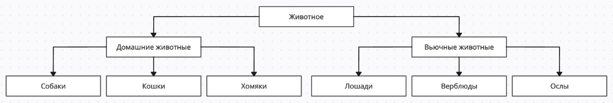

## Итоговая контрольная работа по блоку специализация
<details><summary><b>Урок 2. Итоговая контрольная работа</b></summary>

#### Информация о проекте
Необходимо организовать систему учета для питомника в котором живут домашние и вьючные животные.
#### Как сдавать проект
Для сдачи проекта необходимо создать отдельный общедоступный репозиторий (Github, gitlub, или Bitbucket).
Разработку вести в этом репозитории, использовать пул реквесты на изменения.
Программа должна запускаться и работать, ошибок при выполнении программы быть не должно.
Программа, может использоваться в различных системах, поэтому необходимо разработать класс в виде конструктора.
#### Задание
1. Используя команду cat в терминале операционной системы Linux, создать два файла Домашние животные (заполнив файл
   собаками, кошками, хомяками) и Вьючные животные заполнив файл Лошадьми, верблюдами и ослы), а затем объединить их.
   Просмотреть содержимое созданного файла. Переименовать файл, дав ему новое имя (Друзья человека).
2. Создать директорию, переместить файл туда.
3. Подключить дополнительный репозиторий MySQL. Установить любой пакет из этого репозитория.
4. Установить и удалить deb-пакет с помощью dpkg.
5. Выложить историю команд в терминале ubuntu.
6. Нарисовать диаграмму, в которой есть родительский класс, домашние животные и вьючные животные, в составы которых в
   случае домашних животных войдут классы: собаки, кошки, хомяки, а в класс вьючные животные войдут: Лошади, верблюды
   и ослы).
7. В подключенном MySQL репозитории создать базу данных “Друзья человека”.
8. Создать таблицы с иерархией из диаграммы в БД.
9. Заполнить низкоуровневые таблицы именами(животных), командами которые они выполняют и датами рождения.
10. Удалив из таблицы верблюдов, т.к. верблюдов решили перевезти в другой питомник на зимовку. Объединить таблицы
    лошади, и ослы в одну таблицу.
11. Создать новую таблицу “молодые животные” в которую попадут все животные старше 1 года, но младше 3 лет и в отдельном
    столбце с точностью до месяца подсчитать возраст животных в новой таблице.
12. Объединить все таблицы в одну, при этом сохраняя поля, указывающие на прошлую принадлежность к старым таблицам.
13. Создать класс с Инкапсуляцией методов и наследованием по диаграмме.
14. Написать программу, имитирующую работу реестра домашних животных.
    В программе должен быть реализован следующий функционал:
    1. Завести новое животное
    2. Определять животное в правильный класс
    3. Увидеть список команд, которое выполняет животное
    4. Обучить животное новым командам
    5. Реализовать навигацию по меню
15. Создайте класс Счетчик, у которого есть метод add(), увеличивающий значение внутренней int переменной на 1 при
    нажатии “Завести новое животное” Сделайте так, чтобы с объектом такого типа можно было работать в блоке
    try-with-resources. Нужно бросить исключение, если работа с объектом типа счетчик была не в ресурсном try и/или
    ресурс остался открыт. Значение считать в ресурсе try, если при заведения животного заполнены все поля.

</details>

#### 1 и 2 задания:
```bash
cat > "Домашние животные"
cat > "Вьючные животные"
cat "Домашние животные" "Вьючные животные" > "Животные"
cat "Животные"
mv "Животные" "Друзья человека"
mkdir animals
mv "Друзья человека" animals/
ls animals/ -alt
```
#### 3 и 4 задания:
```bash
sudo nano /etc/apt/sources.list.d/mysql.list
deb http://repo.mysql.com/apt/ubuntu/ focal mysql-apt-config
wget -c https://dev.mysql.com/doc/mysql-apt-config.deb
sudo dpkg -i mysql-apt-config.deb
sudo apt update
sudo apt install mysql-server
sudo dpkg -i имя_пакета.deb
sudo dpkg -r имя_пакета
sudo dpkg -P имя_пакета
```
#### 5 задание:
```bash
history > history.txt
```
#### 6 задание:

#### 7 задание:
```bash
mysql -u root -p
CREATE DATABASE `Друзья_человека`;
```
#### 8 задание:
```bash
USE `Друзья_человека`;
CREATE TABLE Животное (
id INT AUTO_INCREMENT PRIMARY KEY,
имя VARCHAR(255),
тип VARCHAR(255)
);
CREATE TABLE Домашние_животные (
id INT AUTO_INCREMENT PRIMARY KEY,
особенности VARCHAR(255),
FOREIGN KEY (id) REFERENCES Животное(id)
);
CREATE TABLE Вьючные_животные (
id INT AUTO_INCREMENT PRIMARY KEY,
грузоподъемность VARCHAR(255),
FOREIGN KEY (id) REFERENCES Животное(id)
);
CREATE TABLE Собаки (
id INT AUTO_INCREMENT PRIMARY KEY,
порода VARCHAR(255),
FOREIGN KEY (id) REFERENCES Домашние_животные(id)
);
CREATE TABLE Кошки (
id INT AUTO_INCREMENT PRIMARY KEY,
окрас VARCHAR(255),
FOREIGN KEY (id) REFERENCES Домашние_животные(id)
);
CREATE TABLE Хомяки (
id INT AUTO_INCREMENT PRIMARY KEY,
колесо VARCHAR(255),
FOREIGN KEY (id) REFERENCES Домашние_животные(id)
);
CREATE TABLE Лошади (
id INT AUTO_INCREMENT PRIMARY KEY,
особенности VARCHAR(255),
FOREIGN KEY (id) REFERENCES Вьючные_животные(id)
);
CREATE TABLE Верблюды (
id INT AUTO_INCREMENT PRIMARY KEY,
горбы VARCHAR(255),
FOREIGN KEY (id) REFERENCES Вьючные_животные(id)
);
CREATE TABLE Ослы (
id INT AUTO_INCREMENT PRIMARY KEY,
упряжка VARCHAR(255),
FOREIGN KEY (id) REFERENCES Вьючные_животные(id)
);
```
#### 9 задание:
```bash
INSERT INTO Животное (имя, тип) VALUES
('Рекс', 'Собака'),
('Мурка', 'Кошка'),
('Буся', 'Хомяк'),
('Руслан', 'Лошадь'),
('Альфа', 'Верблюд'),
('Игорь', 'Осел');
INSERT INTO Домашние_животные (id, особенности) VALUES
(1, 'Знает команду "Сидеть"'),
(2, 'Любит лазить на деревья'),
(3, 'Бегает по колесу');
INSERT INTO Вьючные_животные (id, грузоподъемность) VALUES
(4, 'Может нести груз до 100 кг'),
(5, 'Имеет 2 горба'),
(6, 'Умеет тянуть упряжку');
```
#### 10 задание:
```bash
# Создадим временную таблицу, чтобы объединить данные
CREATE TABLE Временная_таблица AS
SELECT * FROM Лошади
UNION
SELECT * FROM Верблюды
UNION
SELECT * FROM Ослы;
# Удалим старые таблицы
DROP TABLE Лошади;
DROP TABLE Верблюды;
DROP TABLE Ослы;
# Переименуем временную таблицу обратно в Вьючные_животные
ALTER TABLE Временная_таблица RENAME TO Вьючные_животные;
```
#### 11 задание:
```bash
CREATE TABLE молодые_животные AS
SELECT *
FROM Животное
WHERE тип IN ('Собака', 'Кошка', 'Хомяк') AND DATEDIFF(CURRENT_DATE(), дата_рождения)
BETWEEN 365 AND 1095;
ALTER TABLE молодые_животные ADD COLUMN возраст_в_месяцах INT;
UPDATE молодые_животные
SET возраст_в_месяцах = FLOOR(DATEDIFF(CURRENT_DATE(), дата_рождения) / 30.44);
```
#### 12 задание:
```bash
CREATE TABLE Все_животные AS
SELECT
id,
имя,
тип,
особенности,
NULL AS грузоподъемность,
NULL AS порода,
NULL AS окрас,
NULL AS колесо,
NULL AS горбы,
NULL AS упряжка,
возраст_в_месяцах
FROM Животное
LEFT JOIN Домашние_животные ON Животное.id = Домашние_животные.id
LEFT JOIN Вьючные_животные ON Животное.id = Вьючные_животные.id
LEFT JOIN Собаки ON Животное.id = Собаки.id
LEFT JOIN Кошки ON Животное.id = Кошки.id
LEFT JOIN Хомяки ON Животное.id = Хомяки.id
LEFT JOIN Лошади ON Животное.id = Лошади.id
LEFT JOIN Верблюды ON Животное.id = Верблюды.id
LEFT JOIN Ослы ON Животное.id = Ослы.id;
ALTER TABLE Все_животные ADD COLUMN принадлежность VARCHAR(50);
UPDATE Все_животные
SET принадлежность =
CASE
WHEN особенности IS NOT NULL THEN 'Домашние животные'
WHEN грузоподъемность IS NOT NULL THEN 'Вьючные животные'
WHEN порода IS NOT NULL THEN 'Собаки'
WHEN окрас IS NOT NULL THEN 'Кошки'
WHEN колесо IS NOT NULL THEN 'Хомяки'
WHEN горбы IS NOT NULL THEN 'Лошади'
WHEN упряжка IS NOT NULL THEN 'Верблюды'
ELSE 'Ослы'
END;
```
#### 13, 14 и 15 задания
[application](app)